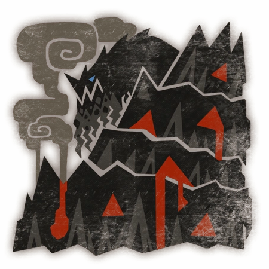

# Zorah



Zorah es un asistente privado y de código abierto para macOS. Vive en la barra
de menú, responde a gestos sonoros y ofrece transcripción y traducción mediante
los frameworks nativos de Apple.

> Proyecto no oficial creado por fans. No está afiliado, patrocinado ni
> respaldado por Capcom.

## Funciones

- Aplicación SwiftUI de barra de menú.
- Transcripción desde el micrófono con Speech.
- Traducción local con Translation.
- Español, inglés, francés, alemán, italiano y portugués.
- Detección nativa de doble, triple y cuádruple aplauso.
- Control de Apple Music y consulta del clima.
- Atajo global `⌥⌘T` para comenzar o detener la transcripción.
- Lectura en voz alta y copia al portapapeles.
- Historial local opcional, desactivado por defecto.
- Configuración de privacidad, sensibilidad, ubicación y playlists.

## Requisitos

- Mac con Apple Silicon.
- macOS 15 o posterior.
- Conexión a Internet para el clima y la descarga inicial de idiomas.

La aplicación nativa no necesita Python, Kokoro ni los modelos ONNX del
prototipo original.

## Instalar desde un DMG

1. Descarga `Zorah-<versión>-arm64.dmg` desde GitHub Releases.
2. Abre el DMG.
3. Arrastra `Zorah.app` a `Applications`.
4. Abre Zorah desde Aplicaciones y busca su icono en la barra de menú.
5. Autoriza micrófono, reconocimiento de voz y control de Apple Music cuando
   macOS lo solicite.

Las compilaciones comunitarias actuales usan firma local y no están
notarizadas. Gatekeeper puede impedir el primer inicio. En ese caso, haz clic
derecho sobre Zorah, selecciona **Abrir** y confirma la apertura. También puedes
autorizarla desde **Ajustes del Sistema > Privacidad y seguridad**.

## Construir desde el código

Requiere Swift y las Command Line Tools de Apple.

```bash
./script/build_and_run.sh
```

El comando construye `dist/Zorah.app` y abre la utilidad en la barra de menú.
Para verificar Swift y las pruebas del detector legado:

```bash
./script/check.sh
```

## Crear el paquete de distribución

```bash
./script/package_release.sh
```

El script genera dentro de `dist/`:

```text
Zorah.app
Zorah-0.1.0-arm64.dmg
Zorah-0.1.0-arm64.dmg.sha256
```

El DMG contiene `Zorah.app` y un acceso directo a `/Applications`. `dist/` está
ignorado por Git: adjunta el DMG y su checksum manualmente a una GitHub Release
en lugar de añadirlos al repositorio.

Para producir otra versión:

```bash
VERSION=0.2.0 ./script/package_release.sh
```

## Privacidad

- Zorah no conserva grabaciones de audio.
- El historial de traducciones está desactivado por defecto.
- La transcripción puede configurarse para exigir procesamiento local.
- Translation procesa en el dispositivo los idiomas instalados.
- El clima consulta Open-Meteo y necesita Internet.
- Apple puede requerir descargas adicionales para voz y traducción.

## Detector Python legado

El prototipo original continúa disponible como referencia en `detector.py`.
Para ejecutarlo:

```bash
python3 -m pip install -r requirements.txt
python3 detector.py
```

Kokoro necesita `kokoro-v1.0.onnx` y `voices-v1.0.bin` en la raíz del proyecto.
Si no puede cargarse, el prototipo utiliza la voz del sistema.

## Contribuir

Consulta [CONTRIBUTING.md](CONTRIBUTING.md) antes de abrir un pull request.
Los errores, propuestas y mejoras son bienvenidos.

## Licencia y recursos

El código y la documentación original se distribuyen bajo la
[licencia MIT](LICENSE).

El icono representa a Zorah Magdaros, personaje de Monster Hunter. Ese nombre,
personaje y la ilustración no están cubiertos por la licencia MIT. El proyecto
no concede derechos sobre recursos propiedad de Capcom o de terceros. Consulta
[THIRD_PARTY_NOTICES.md](THIRD_PARTY_NOTICES.md).

## Roadmap

- Acciones configurables para cada gesto.
- Inicio automático con macOS.
- Pruebas adicionales de audio, permisos y traducción sin conexión.
- Distribución universal para Apple Silicon e Intel.
